 
   

 
   

  
  
  

 
   

<table width="100%">

<tr>

<td align="center" width="50%">

### Lenguajes

 

<code>Java</code> <code>JavaScript</code> <code>HTML5</code> <code>CSS3</code> <code>SQL</code>

</td>

<td align="center" width="50%">

### Frontend

 

<code>React</code> <code>React Native</code> <code>Vite</code> <code>Tailwind CSS</code> <code>JavaFX</code> <code>Framer Motion</code>

</td>

</tr>

<tr>

<td align="center" width="50%">

### Backend

 

<code>Node.js</code> <code>Express.js</code> <code>REST API</code> <code>Socket.IO</code> <code>JWT</code> 

</td>

<td align="center" width="50%">

### Herramientas

 

<code>Git</code> <code>GitHub</code> <code>VS Code</code> <code>Postman</code> <code>npm</code> <code>Tauri</code>

</td>

</tr>

<tr>

<td align="center" width="50%">

### Bases de Datos

 

<code>MySQL</code> <code>MongoDB</code> <code>MongoDB Atlas</code>

</td>

<td align="center" width="50%">

### Deploy & Servicios

 

<code>Vercel</code> <code>Render</code> <code>MongoDB Atlas</code>

</td>

</tr>

</table>

